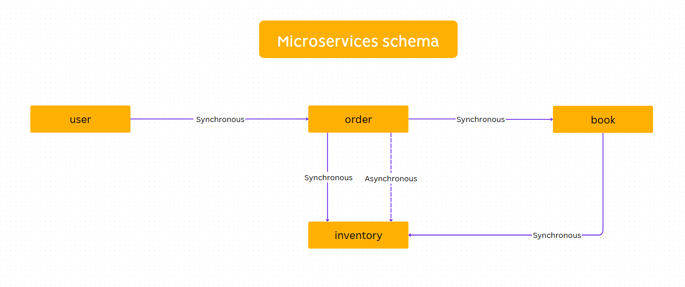

# Navigation 📌
- [API Endpoints ↔️](#api-endpoints-%EF%B8%8F)
- [Database Schema 📅](#database-schema-)
# Microservices Schema

# API Endpoints ↔️
## User Microservice 👤
| Method | Endpoint            | Purpose                  |
|--------|---------------------|---------------------------|
| POST   | /api/users/register  | Register new user         |
| POST   | /api/users/login     | Authenticate user (login) |
| GET    | /api/users/:userId   | Get user profile          |
| PUT    | /api/users/:userId   | Update user profile       |
| DELETE | /api/users/:userId   | Delete user account       |
## Book Microservice 📚
| Method | Endpoint             | Purpose              |
|--------|----------------------|----------------------|
| POST   | /api/books            | Add a new book       |
| GET    | /api/books            | List all books       |
| GET    | /api/books/:bookId    | Get details of a book|
| PUT    | /api/books/:bookId    | Update book details  |
| DELETE | /api/books/:bookId    | Delete a book        |
## Order Service 🛒
| Method | Endpoint                      | Purpose                  |
|--------|-------------------------------|--------------------------|
| POST   | /api/orders                    | Create a new order (checkout) |
| GET    | /api/orders                    | List all orders          |
| GET    | /api/orders/:orderId           | Get details of an order  |
| PUT    | /api/orders/:orderId/cancel    | Cancel an order          |
## Inventory Service 📦
| Method | Endpoint                      | Purpose                       |
|--------|-------------------------------|-------------------------------|
| POST   | /api/inventory                 | Add stock for a book          |
| GET    | /api/inventory                 | Get inventory list            |
| GET    | /api/inventory/:bookId         | Check stock for a specific book|
| PUT    | /api/inventory/:bookId         | Update stock quantity         |
# Database Schema 📅
## Users Database 👤
| Field         | Type       | Description                        |
|---------------|------------|------------------------------------|
| _id           | ObjectId   | Unique identifier                  |
| name          | String     | Name of the user                   |
| email         | String     | Email address                      |
| password  | String     | Hashed password  |
| role          | String     | User role ('customer', 'admin')    |
## Books Database 📚
| Field         | Type       | Description                         |
|---------------|------------|-------------------------------------|
| _id           | ObjectId   | Unique identifier                   |
| title         | String     | Title of the book                   |
| author        | String     | Author of the book                  |
| description   | String     | Description of the book             |
| price         | Number     | Price of the book                   |
| category      | String     | Category of the book                |
| ISBN          | String     | ISBN number                         |
## Orders Database 🛒
| Field     | Type       | Description                        |
|-----------|------------|------------------------------------|
| _id       | ObjectId   | Unique identifier                  |
| userId    | ObjectId   | Reference to the user              |
| items     | Array      | List of book IDs                   |
| totalPrice| Number     | Total price of the order           |
| status    | String     | Order status ('pending', 'completed', 'cancelled') |
## Inventory Database 📦
| Field            | Type       | Description                         |
|------------------|------------|-------------------------------------|
| _id              | ObjectId   | Unique identifier                   |
| bookId           | ObjectId   | Reference to the book               |
| quantity         | Number     | Quantity of stock                   |
| lastRestockDate  | Date       | Date of the last restock            |
